<a href="https://alisoleimaninet.github.io"><picture><source media="(prefers-color-scheme: dark)" srcset="assets/header-dark.svg"><source media="(prefers-color-scheme: light)" srcset="assets/header-light.svg"></picture></a>

<a href="https://helpsy.ir"><picture><source media="(prefers-color-scheme: dark)" srcset="assets/pills/helpsy-dark.svg"><source media="(prefers-color-scheme: light)" srcset="assets/pills/helpsy-light.svg"></picture></a>
<a href="https://alisoleimaninet.github.io/#project-gymivo"><picture><source media="(prefers-color-scheme: dark)" srcset="assets/pills/gymivo-dark.svg"><source media="(prefers-color-scheme: light)" srcset="assets/pills/gymivo-light.svg"></picture></a>
<a href="https://barnabus.ai"><picture><source media="(prefers-color-scheme: dark)" srcset="assets/pills/barnabus-dark.svg"><source media="(prefers-color-scheme: light)" srcset="assets/pills/barnabus-light.svg"></picture></a>
<a href="https://alisoleimaninet.github.io/#architecture"><picture><source media="(prefers-color-scheme: dark)" srcset="assets/pills/stack-dark.svg"><source media="(prefers-color-scheme: light)" srcset="assets/pills/stack-light.svg"></picture></a>
<a href="https://www.linkedin.com/in/ali-soleimani-net/"><picture><source media="(prefers-color-scheme: dark)" srcset="assets/pills/msc-dark.svg"><source media="(prefers-color-scheme: light)" srcset="assets/pills/msc-light.svg"></picture></a>
<a href="https://alisoleimaninet.github.io/#contact"><picture><source media="(prefers-color-scheme: dark)" srcset="assets/pills/location-dark.svg"><source media="(prefers-color-scheme: light)" srcset="assets/pills/location-light.svg"></picture></a>

<a href="https://alisoleimaninet.github.io"><picture><source media="(prefers-color-scheme: dark)" srcset="assets/buttons/portfolio-dark.svg"><source media="(prefers-color-scheme: light)" srcset="assets/buttons/portfolio-light.svg"></picture></a>
<a href="https://www.linkedin.com/in/ali-soleimani-net/"><picture><source media="(prefers-color-scheme: dark)" srcset="assets/buttons/linkedin-dark.svg"><source media="(prefers-color-scheme: light)" srcset="assets/buttons/linkedin-light.svg"></picture></a>
<a href="mailto:AliSoleimaniWorks@gmail.com"><picture><source media="(prefers-color-scheme: dark)" srcset="assets/buttons/email-dark.svg"><source media="(prefers-color-scheme: light)" srcset="assets/buttons/email-light.svg"></picture></a>

 

<a href="https://alisoleimaninet.github.io/#about"><picture><source media="(prefers-color-scheme: dark)" srcset="assets/sections/about-dark.svg"><source media="(prefers-color-scheme: light)" srcset="assets/sections/about-light.svg"></picture></a>

I am tech lead and software architect at **[Helpsy](https://helpsy.ir)**, a mental-health clinic platform: I designed its system architecture, lead the backend and frontend teams, and run the servers and delivery pipeline behind it. I am co-founder of **[Gymivo](https://alisoleimaninet.github.io/#project-gymivo)**, a fitness platform launching soon, where I lead the backend. I also write **Go**, and designed and built the identity and access platform behind **[Barnabus](https://barnabus.ai)**. Before that I designed, built and still operate a self-service payment kiosk network that handles thousands of payments a day. It all started when I was a teenager, building websites for companies and online stores and hosting them myself.

I like the hard parts: distributed systems, identity, payments and the infrastructure that keeps them honest. I am a graduate student in Software Engineering at the University of Isfahan, and I care about clean architecture, developer tooling and documentation people actually read.

 

<a href="https://alisoleimaninet.github.io/#projects"><picture><source media="(prefers-color-scheme: dark)" srcset="assets/sections/building-dark.svg"><source media="(prefers-color-scheme: light)" srcset="assets/sections/building-light.svg"></picture></a>

<a href="https://alisoleimaninet.github.io/#project-helpsy"><picture><source media="(prefers-color-scheme: dark)" srcset="assets/projects/helpsy-dark.svg"><source media="(prefers-color-scheme: light)" srcset="assets/projects/helpsy-light.svg"></picture></a>
<a href="https://alisoleimaninet.github.io/#project-barnabus"><picture><source media="(prefers-color-scheme: dark)" srcset="assets/projects/barnabus-dark.svg"><source media="(prefers-color-scheme: light)" srcset="assets/projects/barnabus-light.svg"></picture></a>
<a href="https://alisoleimaninet.github.io/#project-gymivo"><picture><source media="(prefers-color-scheme: dark)" srcset="assets/projects/gymivo-dark.svg"><source media="(prefers-color-scheme: light)" srcset="assets/projects/gymivo-light.svg"></picture></a>
<a href="https://alisoleimaninet.github.io/#project-kiosk"><picture><source media="(prefers-color-scheme: dark)" srcset="assets/projects/kiosk-dark.svg"><source media="(prefers-color-scheme: light)" srcset="assets/projects/kiosk-light.svg"></picture></a>
<a href="https://alisoleimaninet.github.io/#project-kiosell"><picture><source media="(prefers-color-scheme: dark)" srcset="assets/projects/kiosell-dark.svg"><source media="(prefers-color-scheme: light)" srcset="assets/projects/kiosell-light.svg"></picture></a>

 

<a href="https://github.com/AliSoleimaniNet?tab=repositories"><picture><source media="(prefers-color-scheme: dark)" srcset="assets/sections/opensource-dark.svg"><source media="(prefers-color-scheme: light)" srcset="assets/sections/opensource-light.svg"></picture></a>

<a href="https://github.com/AliSoleimaniNet/Uber-Data-Intelligence-Platform"><picture><source media="(prefers-color-scheme: dark)" srcset="https://raw.githubusercontent.com/AliSoleimaniNet/AliSoleimaniNet/output/repos/Uber-Data-Intelligence-Platform-dark.svg"><source media="(prefers-color-scheme: light)" srcset="https://raw.githubusercontent.com/AliSoleimaniNet/AliSoleimaniNet/output/repos/Uber-Data-Intelligence-Platform-light.svg"></picture></a>
<a href="https://github.com/AliSoleimaniNet/QuizDSL-Studio"><picture><source media="(prefers-color-scheme: dark)" srcset="https://raw.githubusercontent.com/AliSoleimaniNet/AliSoleimaniNet/output/repos/QuizDSL-Studio-dark.svg"><source media="(prefers-color-scheme: light)" srcset="https://raw.githubusercontent.com/AliSoleimaniNet/AliSoleimaniNet/output/repos/QuizDSL-Studio-light.svg"></picture></a>
<a href="https://github.com/AliSoleimaniNet/ProxyChainer"><picture><source media="(prefers-color-scheme: dark)" srcset="https://raw.githubusercontent.com/AliSoleimaniNet/AliSoleimaniNet/output/repos/ProxyChainer-dark.svg"><source media="(prefers-color-scheme: light)" srcset="https://raw.githubusercontent.com/AliSoleimaniNet/AliSoleimaniNet/output/repos/ProxyChainer-light.svg"></picture></a>
<a href="https://github.com/AliSoleimaniNet/ExpressFinder"><picture><source media="(prefers-color-scheme: dark)" srcset="https://raw.githubusercontent.com/AliSoleimaniNet/AliSoleimaniNet/output/repos/ExpressFinder-dark.svg"><source media="(prefers-color-scheme: light)" srcset="https://raw.githubusercontent.com/AliSoleimaniNet/AliSoleimaniNet/output/repos/ExpressFinder-light.svg"></picture></a>
<a href="https://github.com/AliSoleimaniNet/TSP-Bokeh-Genetic-PSO-AntColony"><picture><source media="(prefers-color-scheme: dark)" srcset="https://raw.githubusercontent.com/AliSoleimaniNet/AliSoleimaniNet/output/repos/TSP-Bokeh-Genetic-PSO-AntColony-dark.svg"><source media="(prefers-color-scheme: light)" srcset="https://raw.githubusercontent.com/AliSoleimaniNet/AliSoleimaniNet/output/repos/TSP-Bokeh-Genetic-PSO-AntColony-light.svg"></picture></a>
<a href="https://github.com/AliSoleimaniNet/ShamsiDate"><picture><source media="(prefers-color-scheme: dark)" srcset="https://raw.githubusercontent.com/AliSoleimaniNet/AliSoleimaniNet/output/repos/ShamsiDate-dark.svg"><source media="(prefers-color-scheme: light)" srcset="https://raw.githubusercontent.com/AliSoleimaniNet/AliSoleimaniNet/output/repos/ShamsiDate-light.svg"></picture></a>

 

<a href="https://alisoleimaninet.github.io/#architecture"><picture><source media="(prefers-color-scheme: dark)" srcset="assets/sections/architecture-dark.svg"><source media="(prefers-color-scheme: light)" srcset="assets/sections/architecture-light.svg"></picture></a>

<a href="https://alisoleimaninet.github.io/#architecture"><picture><source media="(prefers-color-scheme: dark)" srcset="assets/reference-architecture-dark.svg"><source media="(prefers-color-scheme: light)" srcset="assets/reference-architecture-light.svg">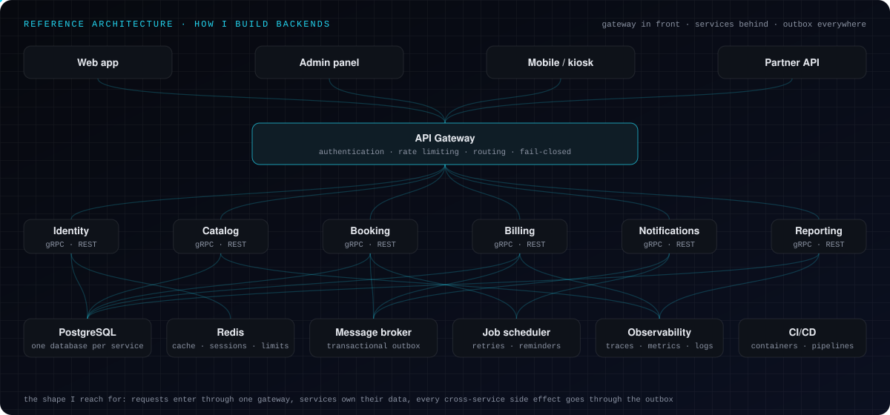</picture></a>

 

<a href="https://alisoleimaninet.github.io/#principles"><picture><source media="(prefers-color-scheme: dark)" srcset="assets/sections/principles-dark.svg"><source media="(prefers-color-scheme: light)" srcset="assets/sections/principles-light.svg"></picture></a>

<a href="https://alisoleimaninet.github.io/#principles"><picture><source media="(prefers-color-scheme: dark)" srcset="assets/principles/1-dark.svg"><source media="(prefers-color-scheme: light)" srcset="assets/principles/1-light.svg">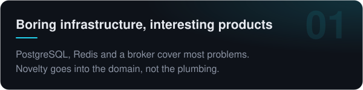</picture></a>
<a href="https://alisoleimaninet.github.io/#principles"><picture><source media="(prefers-color-scheme: dark)" srcset="assets/principles/2-dark.svg"><source media="(prefers-color-scheme: light)" srcset="assets/principles/2-light.svg">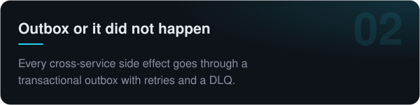</picture></a>
<a href="https://alisoleimaninet.github.io/#principles"><picture><source media="(prefers-color-scheme: dark)" srcset="assets/principles/3-dark.svg"><source media="(prefers-color-scheme: light)" srcset="assets/principles/3-light.svg">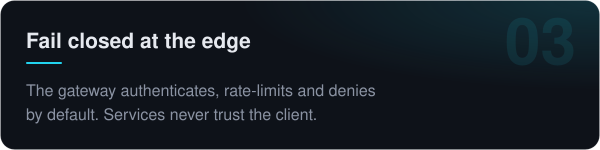</picture></a>
<a href="https://alisoleimaninet.github.io/#principles"><picture><source media="(prefers-color-scheme: dark)" srcset="assets/principles/4-dark.svg"><source media="(prefers-color-scheme: light)" srcset="assets/principles/4-light.svg">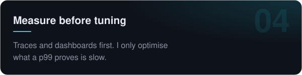</picture></a>
<a href="https://alisoleimaninet.github.io/#principles"><picture><source media="(prefers-color-scheme: dark)" srcset="assets/principles/5-dark.svg"><source media="(prefers-color-scheme: light)" srcset="assets/principles/5-light.svg">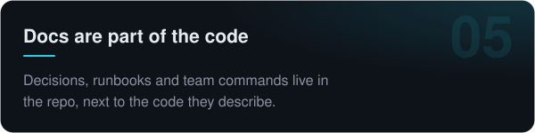</picture></a>
<a href="https://alisoleimaninet.github.io/#principles"><picture><source media="(prefers-color-scheme: dark)" srcset="assets/principles/6-dark.svg"><source media="(prefers-color-scheme: light)" srcset="assets/principles/6-light.svg">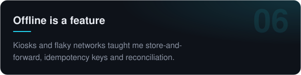</picture></a>

 

<a href="https://www.linkedin.com/in/ali-soleimani-net/"><picture><source media="(prefers-color-scheme: dark)" srcset="assets/sections/experience-dark.svg"><source media="(prefers-color-scheme: light)" srcset="assets/sections/experience-light.svg"></picture></a>

<a href="https://helpsy.ir"><picture><source media="(prefers-color-scheme: dark)" srcset="assets/experience/helpsy-dark.svg"><source media="(prefers-color-scheme: light)" srcset="assets/experience/helpsy-light.svg">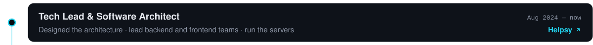</picture></a>
<a href="https://alisoleimaninet.github.io/#project-gymivo"><picture><source media="(prefers-color-scheme: dark)" srcset="assets/experience/gymivo-dark.svg"><source media="(prefers-color-scheme: light)" srcset="assets/experience/gymivo-light.svg">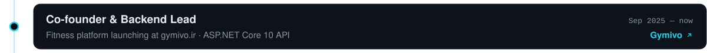</picture></a>
<a href="https://www.linkedin.com/in/ali-soleimani-net/"><picture><source media="(prefers-color-scheme: dark)" srcset="assets/experience/ta-ase-dark.svg"><source media="(prefers-color-scheme: light)" srcset="assets/experience/ta-ase-light.svg">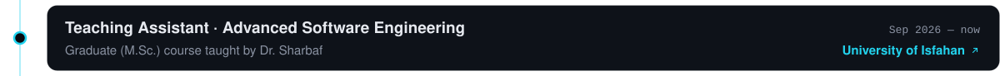</picture></a>
<a href="https://barnabus.ai"><picture><source media="(prefers-color-scheme: dark)" srcset="assets/experience/barnabus-dark.svg"><source media="(prefers-color-scheme: light)" srcset="assets/experience/barnabus-light.svg"></picture></a>
<a href="https://www.linkedin.com/in/ali-soleimani-net/"><picture><source media="(prefers-color-scheme: dark)" srcset="assets/experience/msc-dark.svg"><source media="(prefers-color-scheme: light)" srcset="assets/experience/msc-light.svg">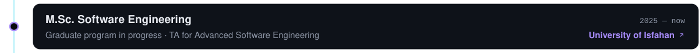</picture></a>
<a href="https://www.linkedin.com/in/ali-soleimani-net/"><picture><source media="(prefers-color-scheme: dark)" srcset="assets/experience/ta-dark.svg"><source media="(prefers-color-scheme: light)" srcset="assets/experience/ta-light.svg">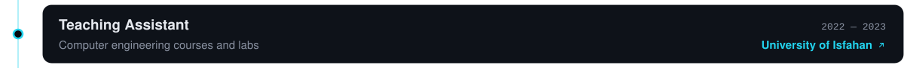</picture></a>
<a href="https://bar1.ir"><picture><source media="(prefers-color-scheme: dark)" srcset="assets/experience/bar1-dark.svg"><source media="(prefers-color-scheme: light)" srcset="assets/experience/bar1-light.svg">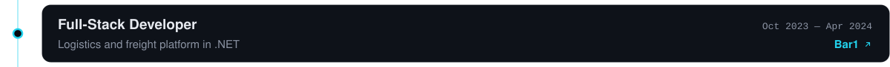</picture></a>
<a href="https://alisoleimaninet.github.io/#project-kiosk"><picture><source media="(prefers-color-scheme: dark)" srcset="assets/experience/kiosk-dark.svg"><source media="(prefers-color-scheme: light)" srcset="assets/experience/kiosk-light.svg">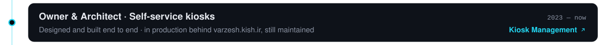</picture></a>
<a href="https://www.linkedin.com/in/ali-soleimani-net/"><picture><source media="(prefers-color-scheme: dark)" srcset="assets/experience/bsc-dark.svg"><source media="(prefers-color-scheme: light)" srcset="assets/experience/bsc-light.svg">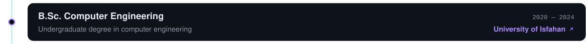</picture></a>
<a href="https://ojeamoozesh.ir"><picture><source media="(prefers-color-scheme: dark)" srcset="assets/experience/oje-dark.svg"><source media="(prefers-color-scheme: light)" srcset="assets/experience/oje-light.svg">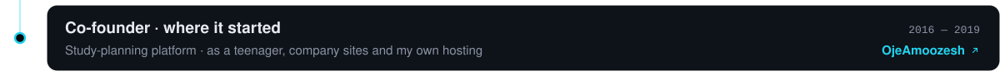</picture></a>

 

<a href="https://alisoleimaninet.github.io/#stack"><picture><source media="(prefers-color-scheme: dark)" srcset="assets/sections/stack-dark.svg"><source media="(prefers-color-scheme: light)" srcset="assets/sections/stack-light.svg"></picture></a>

<a href="https://alisoleimaninet.github.io/#stack"><picture><source media="(prefers-color-scheme: dark)" srcset="assets/stack/_backend-dark.svg"><source media="(prefers-color-scheme: light)" srcset="assets/stack/_backend-light.svg"></picture></a>
<a href="https://learn.microsoft.com/dotnet/csharp/"><picture><source media="(prefers-color-scheme: dark)" srcset="assets/stack/c--dark.svg"><source media="(prefers-color-scheme: light)" srcset="assets/stack/c--light.svg"></picture></a>
<a href="https://dotnet.microsoft.com/"><picture><source media="(prefers-color-scheme: dark)" srcset="assets/stack/-net-dark.svg"><source media="(prefers-color-scheme: light)" srcset="assets/stack/-net-light.svg"></picture></a>
<a href="https://learn.microsoft.com/aspnet/core/"><picture><source media="(prefers-color-scheme: dark)" srcset="assets/stack/asp-net-core-dark.svg"><source media="(prefers-color-scheme: light)" srcset="assets/stack/asp-net-core-light.svg"></picture></a>
<a href="https://go.dev/"><picture><source media="(prefers-color-scheme: dark)" srcset="assets/stack/go-dark.svg"><source media="(prefers-color-scheme: light)" srcset="assets/stack/go-light.svg"></picture></a>
<a href="https://grpc.io/"><picture><source media="(prefers-color-scheme: dark)" srcset="assets/stack/grpc-dark.svg"><source media="(prefers-color-scheme: light)" srcset="assets/stack/grpc-light.svg">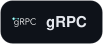</picture></a>
<a href="https://learn.microsoft.com/ef/core/"><picture><source media="(prefers-color-scheme: dark)" srcset="assets/stack/ef-core-dark.svg"><source media="(prefers-color-scheme: light)" srcset="assets/stack/ef-core-light.svg"></picture></a>
<a href="https://github.com/DapperLib/Dapper"><picture><source media="(prefers-color-scheme: dark)" srcset="assets/stack/dapper-dark.svg"><source media="(prefers-color-scheme: light)" srcset="assets/stack/dapper-light.svg"></picture></a>
<a href="https://github.com/jbogard/MediatR"><picture><source media="(prefers-color-scheme: dark)" srcset="assets/stack/mediatr-cqrs-dark.svg"><source media="(prefers-color-scheme: light)" srcset="assets/stack/mediatr-cqrs-light.svg"></picture></a>
<a href="https://masstransit.io/"><picture><source media="(prefers-color-scheme: dark)" srcset="assets/stack/masstransit-dark.svg"><source media="(prefers-color-scheme: light)" srcset="assets/stack/masstransit-light.svg"></picture></a>
<a href="https://microsoft.github.io/reverse-proxy/"><picture><source media="(prefers-color-scheme: dark)" srcset="assets/stack/yarp-dark.svg"><source media="(prefers-color-scheme: light)" srcset="assets/stack/yarp-light.svg"></picture></a>
<a href="https://www.hangfire.io/"><picture><source media="(prefers-color-scheme: dark)" srcset="assets/stack/hangfire-dark.svg"><source media="(prefers-color-scheme: light)" srcset="assets/stack/hangfire-light.svg"></picture></a>
<a href="https://documentation.openiddict.com/"><picture><source media="(prefers-color-scheme: dark)" srcset="assets/stack/openiddict-dark.svg"><source media="(prefers-color-scheme: light)" srcset="assets/stack/openiddict-light.svg">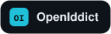</picture></a>
<a href="https://www.python.org/"><picture><source media="(prefers-color-scheme: dark)" srcset="assets/stack/python-dark.svg"><source media="(prefers-color-scheme: light)" srcset="assets/stack/python-light.svg">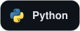</picture></a>

<a href="https://alisoleimaninet.github.io/#stack"><picture><source media="(prefers-color-scheme: dark)" srcset="assets/stack/_data-messaging-dark.svg"><source media="(prefers-color-scheme: light)" srcset="assets/stack/_data-messaging-light.svg">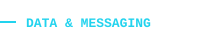</picture></a>
<a href="https://www.postgresql.org/"><picture><source media="(prefers-color-scheme: dark)" srcset="assets/stack/postgresql-dark.svg"><source media="(prefers-color-scheme: light)" srcset="assets/stack/postgresql-light.svg"></picture></a>
<a href="https://www.microsoft.com/sql-server"><picture><source media="(prefers-color-scheme: dark)" srcset="assets/stack/sql-server-dark.svg"><source media="(prefers-color-scheme: light)" srcset="assets/stack/sql-server-light.svg"></picture></a>
<a href="https://www.sqlite.org/"><picture><source media="(prefers-color-scheme: dark)" srcset="assets/stack/sqlite-dark.svg"><source media="(prefers-color-scheme: light)" srcset="assets/stack/sqlite-light.svg"></picture></a>
<a href="https://redis.io/"><picture><source media="(prefers-color-scheme: dark)" srcset="assets/stack/redis-dark.svg"><source media="(prefers-color-scheme: light)" srcset="assets/stack/redis-light.svg"></picture></a>
<a href="https://www.rabbitmq.com/"><picture><source media="(prefers-color-scheme: dark)" srcset="assets/stack/rabbitmq-dark.svg"><source media="(prefers-color-scheme: light)" srcset="assets/stack/rabbitmq-light.svg"></picture></a>
<a href="https://kafka.apache.org/"><picture><source media="(prefers-color-scheme: dark)" srcset="assets/stack/kafka-dark.svg"><source media="(prefers-color-scheme: light)" srcset="assets/stack/kafka-light.svg"></picture></a>
<a href="https://min.io/"><picture><source media="(prefers-color-scheme: dark)" srcset="assets/stack/minio-dark.svg"><source media="(prefers-color-scheme: light)" srcset="assets/stack/minio-light.svg"></picture></a>
<a href="https://qdrant.tech/"><picture><source media="(prefers-color-scheme: dark)" srcset="assets/stack/qdrant-dark.svg"><source media="(prefers-color-scheme: light)" srcset="assets/stack/qdrant-light.svg"></picture></a>

<a href="https://alisoleimaninet.github.io/#stack"><picture><source media="(prefers-color-scheme: dark)" srcset="assets/stack/_infra-observability-dark.svg"><source media="(prefers-color-scheme: light)" srcset="assets/stack/_infra-observability-light.svg">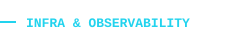</picture></a>
<a href="https://www.docker.com/"><picture><source media="(prefers-color-scheme: dark)" srcset="assets/stack/docker-dark.svg"><source media="(prefers-color-scheme: light)" srcset="assets/stack/docker-light.svg"></picture></a>
<a href="https://kubernetes.io/"><picture><source media="(prefers-color-scheme: dark)" srcset="assets/stack/kubernetes-dark.svg"><source media="(prefers-color-scheme: light)" srcset="assets/stack/kubernetes-light.svg"></picture></a>
<a href="https://nginx.org/"><picture><source media="(prefers-color-scheme: dark)" srcset="assets/stack/nginx-dark.svg"><source media="(prefers-color-scheme: light)" srcset="assets/stack/nginx-light.svg"></picture></a>
<a href="https://kernel.org/"><picture><source media="(prefers-color-scheme: dark)" srcset="assets/stack/linux-dark.svg"><source media="(prefers-color-scheme: light)" srcset="assets/stack/linux-light.svg"></picture></a>
<a href="https://docs.gitlab.com/ci/"><picture><source media="(prefers-color-scheme: dark)" srcset="assets/stack/gitlab-ci-dark.svg"><source media="(prefers-color-scheme: light)" srcset="assets/stack/gitlab-ci-light.svg"></picture></a>
<a href="https://github.com/features/actions"><picture><source media="(prefers-color-scheme: dark)" srcset="assets/stack/github-actions-dark.svg"><source media="(prefers-color-scheme: light)" srcset="assets/stack/github-actions-light.svg"></picture></a>
<a href="https://grafana.com/"><picture><source media="(prefers-color-scheme: dark)" srcset="assets/stack/grafana-dark.svg"><source media="(prefers-color-scheme: light)" srcset="assets/stack/grafana-light.svg"></picture></a>
<a href="https://prometheus.io/"><picture><source media="(prefers-color-scheme: dark)" srcset="assets/stack/prometheus-dark.svg"><source media="(prefers-color-scheme: light)" srcset="assets/stack/prometheus-light.svg"></picture></a>
<a href="https://opentelemetry.io/"><picture><source media="(prefers-color-scheme: dark)" srcset="assets/stack/opentelemetry-dark.svg"><source media="(prefers-color-scheme: light)" srcset="assets/stack/opentelemetry-light.svg"></picture></a>
<a href="https://testcontainers.com/"><picture><source media="(prefers-color-scheme: dark)" srcset="assets/stack/testcontainers-dark.svg"><source media="(prefers-color-scheme: light)" srcset="assets/stack/testcontainers-light.svg"></picture></a>

<a href="https://alisoleimaninet.github.io/#stack"><picture><source media="(prefers-color-scheme: dark)" srcset="assets/stack/_frontend-tooling-dark.svg"><source media="(prefers-color-scheme: light)" srcset="assets/stack/_frontend-tooling-light.svg">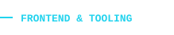</picture></a>
<a href="https://www.typescriptlang.org/"><picture><source media="(prefers-color-scheme: dark)" srcset="assets/stack/typescript-dark.svg"><source media="(prefers-color-scheme: light)" srcset="assets/stack/typescript-light.svg"></picture></a>
<a href="https://nextjs.org/"><picture><source media="(prefers-color-scheme: dark)" srcset="assets/stack/next-js-dark.svg"><source media="(prefers-color-scheme: light)" srcset="assets/stack/next-js-light.svg"></picture></a>
<a href="https://react.dev/"><picture><source media="(prefers-color-scheme: dark)" srcset="assets/stack/react-dark.svg"><source media="(prefers-color-scheme: light)" srcset="assets/stack/react-light.svg">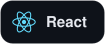</picture></a>
<a href="https://tailwindcss.com/"><picture><source media="(prefers-color-scheme: dark)" srcset="assets/stack/tailwind-dark.svg"><source media="(prefers-color-scheme: light)" srcset="assets/stack/tailwind-light.svg"></picture></a>
<a href="https://threejs.org/"><picture><source media="(prefers-color-scheme: dark)" srcset="assets/stack/three-js-dark.svg"><source media="(prefers-color-scheme: light)" srcset="assets/stack/three-js-light.svg"></picture></a>
<a href="https://git-scm.com/"><picture><source media="(prefers-color-scheme: dark)" srcset="assets/stack/git-dark.svg"><source media="(prefers-color-scheme: light)" srcset="assets/stack/git-light.svg"></picture></a>
<a href="https://ollama.com/"><picture><source media="(prefers-color-scheme: dark)" srcset="assets/stack/ollama-dark.svg"><source media="(prefers-color-scheme: light)" srcset="assets/stack/ollama-light.svg"></picture></a>

 

<a href="https://github.com/AliSoleimaniNet"><picture><source media="(prefers-color-scheme: dark)" srcset="assets/sections/activity-dark.svg"><source media="(prefers-color-scheme: light)" srcset="assets/sections/activity-light.svg"></picture></a>

<a href="https://github.com/AliSoleimaniNet"><picture><source media="(prefers-color-scheme: dark)" srcset="https://raw.githubusercontent.com/AliSoleimaniNet/AliSoleimaniNet/output/stats/contributions-dark.svg"><source media="(prefers-color-scheme: light)" srcset="https://raw.githubusercontent.com/AliSoleimaniNet/AliSoleimaniNet/output/stats/contributions-light.svg"></picture></a>
<a href="https://github.com/AliSoleimaniNet"><picture><source media="(prefers-color-scheme: dark)" srcset="https://raw.githubusercontent.com/AliSoleimaniNet/AliSoleimaniNet/output/stats/streak-dark.svg"><source media="(prefers-color-scheme: light)" srcset="https://raw.githubusercontent.com/AliSoleimaniNet/AliSoleimaniNet/output/stats/streak-light.svg"></picture></a>
<a href="https://github.com/search?q=author%3AAliSoleimaniNet+is%3Apr&type=pullrequests"><picture><source media="(prefers-color-scheme: dark)" srcset="https://raw.githubusercontent.com/AliSoleimaniNet/AliSoleimaniNet/output/stats/prs-dark.svg"><source media="(prefers-color-scheme: light)" srcset="https://raw.githubusercontent.com/AliSoleimaniNet/AliSoleimaniNet/output/stats/prs-light.svg"></picture></a>

<a href="https://github.com/AliSoleimaniNet?tab=repositories"><picture><source media="(prefers-color-scheme: dark)" srcset="https://raw.githubusercontent.com/AliSoleimaniNet/AliSoleimaniNet/output/metrics/languages-dark.svg"><source media="(prefers-color-scheme: light)" srcset="https://raw.githubusercontent.com/AliSoleimaniNet/AliSoleimaniNet/output/metrics/languages-light.svg"></picture></a>
<a href="https://github.com/AliSoleimaniNet?tab=repositories"><picture><source media="(prefers-color-scheme: dark)" srcset="https://raw.githubusercontent.com/AliSoleimaniNet/AliSoleimaniNet/output/stats/overview-dark.svg"><source media="(prefers-color-scheme: light)" srcset="https://raw.githubusercontent.com/AliSoleimaniNet/AliSoleimaniNet/output/stats/overview-light.svg"></picture></a>

<a href="https://github.com/AliSoleimaniNet"><picture><source media="(prefers-color-scheme: dark)" srcset="https://raw.githubusercontent.com/AliSoleimaniNet/AliSoleimaniNet/output/3d/profile-night-green.svg"><source media="(prefers-color-scheme: light)" srcset="https://raw.githubusercontent.com/AliSoleimaniNet/AliSoleimaniNet/output/3d/profile-green-animate.svg"></picture></a>

The 3D graph and its language donut only see public repositories. The languages card above includes private work.

<a href="https://github.com/AliSoleimaniNet"><picture><source media="(prefers-color-scheme: dark)" srcset="https://raw.githubusercontent.com/AliSoleimaniNet/AliSoleimaniNet/output/snake/snake-dark.svg"><source media="(prefers-color-scheme: light)" srcset="https://raw.githubusercontent.com/AliSoleimaniNet/AliSoleimaniNet/output/snake/snake-light.svg"></picture></a>

#### Latest
<!--START_SECTION:activity-->
- 🔒 **370 contributions to private repositories** in the last 30 days · [contribution graph](https://github.com/AliSoleimaniNet)
- `Oct 1` ⬆️ Pushed [8 commits](https://github.com/AliSoleimaniNet/AliSoleimaniNet.github.io/commit/b9ead0384f8744282ce6c1a970e4f7e38c58efa0) to [AliSoleimaniNet.github.io](https://github.com/AliSoleimaniNet/AliSoleimaniNet.github.io) · Reorder experience
- `Sep 27` ⬆️ Pushed [1 commit](https://github.com/AliSoleimaniNet/AliSoleimaniNet.github.io/commit/6e2782caf29f1b241aaa96c4ee9b324f82cbf224) to [AliSoleimaniNet.github.io](https://github.com/AliSoleimaniNet/AliSoleimaniNet.github.io) · Add packet cursor, boot intro, deep links and card lighting
- `Sep 26` ⬆️ Pushed [2 commits](https://github.com/AliSoleimaniNet/AliSoleimaniNet.github.io/commit/bbeb7041e695f3622d2ead398c9f32c82a52bcdb) to [AliSoleimaniNet.github.io](https://github.com/AliSoleimaniNet/AliSoleimaniNet.github.io) · Add architecture, principles, command palette and adaptive quality
<!--END_SECTION:activity-->

 

<a href="https://alisoleimaninet.github.io/#contact"><picture><source media="(prefers-color-scheme: dark)" srcset="assets/sections/contact-dark.svg"><source media="(prefers-color-scheme: light)" srcset="assets/sections/contact-light.svg"></picture></a>

<a href="mailto:AliSoleimaniWorks@gmail.com"><picture><source media="(prefers-color-scheme: dark)" srcset="assets/contact/email-dark.svg"><source media="(prefers-color-scheme: light)" srcset="assets/contact/email-light.svg">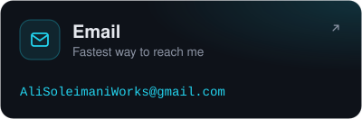</picture></a>
<a href="https://www.linkedin.com/in/ali-soleimani-net/"><picture><source media="(prefers-color-scheme: dark)" srcset="assets/contact/linkedin-dark.svg"><source media="(prefers-color-scheme: light)" srcset="assets/contact/linkedin-light.svg">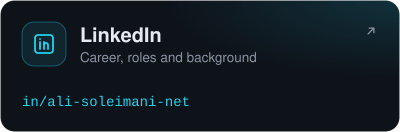</picture></a>
<a href="https://alisoleimaninet.github.io"><picture><source media="(prefers-color-scheme: dark)" srcset="assets/contact/site-dark.svg"><source media="(prefers-color-scheme: light)" srcset="assets/contact/site-light.svg">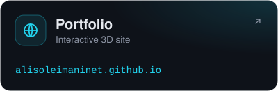</picture></a>

  
   
  Every card on this page is a link. Stats, repository cards and the activity list are regenerated every 6 hours by <a href=".github/workflows">GitHub Actions</a>.

