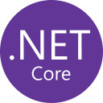
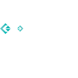
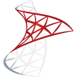
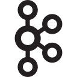

<picture>
  <source media="(prefers-color-scheme: dark)" srcset="assets/header-dark.svg">
  <source media="(prefers-color-scheme: light)" srcset="assets/header-light.svg">
  
</picture>

  
  
  

 

## Hi, I'm Ali 👋

**Backend .NET Tech Lead at [Helpsy](https://helpsy.ir)**, where I lead the engineering behind a mental-health clinic platform: a fleet of ASP.NET Core microservices, an API gateway, event-driven messaging, and the CI/CD and observability that keep it honest.

- 🏗️ I design and run **distributed .NET systems**: gRPC, MassTransit/RabbitMQ with transactional outboxes, PostgreSQL, Redis, YARP, Hangfire, Docker, GitLab CI.
- 🐹 I write **Go** too: most recently a six-service identity & access platform (SSO, MFA, JWKS, policy decision point, mutual TLS) for a healthcare company.
- 🧾 I built and still operate a **self-service payment kiosk** network: bank PC-POS terminals, thermal printers and offline-first sync, processing thousands of transactions a day.
- 🎓 M.Sc. Software Engineering student at the University of Isfahan · 📍 Isfahan, Iran
- 💬 Ask me about clean architecture, CQRS, multi-tenancy, payment integrations and developer tooling.

 

## What I'm building

<table>
  <tr>
    <td width="50%">
      <picture>
        <source media="(prefers-color-scheme: dark)" srcset="assets/cards/helpsy-dark.svg">
        
      </picture>
    </td>
    <td width="50%">
      <picture>
        <source media="(prefers-color-scheme: dark)" srcset="assets/cards/iam-dark.svg">
        
      </picture>
    </td>
  </tr>
  <tr>
    <td width="50%">
      <picture>
        <source media="(prefers-color-scheme: dark)" srcset="assets/cards/kiosk-dark.svg">
        
      </picture>
    </td>
    <td width="50%">
      <picture>
        <source media="(prefers-color-scheme: dark)" srcset="assets/cards/kiosell-dark.svg">
        
      </picture>
    </td>
  </tr>
</table>

Most of my day-to-day work lives in private GitLab and GitHub organizations, so the public stats below undercount it.

 

## Featured open source

  

| Repo | What it is |
|---|---|
| [Uber-Data-Intelligence-Platform](https://github.com/AliSoleimaniNet/Uber-Data-Intelligence-Platform) | End-to-end data platform on **.NET Aspire**: medallion lakehouse on PostgreSQL, Qdrant semantic search, a local LLM via Ollama, React + Tailwind front end |
| [QuizDSL-Studio](https://github.com/AliSoleimaniNet/QuizDSL-Studio) | LLM-assisted model-driven development: an **Xtext** DSL + a .NET 10 service that turn prompts into models and generated apps |
| [ProxyChainer](https://github.com/AliSoleimaniNet/ProxyChainer) | Xray-core config builder that chains VLESS traffic through SOCKS proxies, built with Flet |
| [ExpressFinder](https://github.com/AliSoleimaniNet/ExpressFinder) | Windows tool that automates the ExpressVPN CLI to find and connect to working locations |
| [TSP-Bokeh-Genetic-PSO-AntColony](https://github.com/AliSoleimaniNet/TSP-Bokeh-Genetic-PSO-AntColony) | TSP solved with genetic, particle-swarm and ant-colony metaheuristics, visualised with Bokeh |
| [ShamsiDate](https://github.com/AliSoleimaniNet/ShamsiDate) · [Chess](https://github.com/AliSoleimaniNet/Chess) | Persian calendar events library · WinForms chess with online play and chat |

 

## Tech stack

<table>
  <tr>
    <th align="left">Backend</th>
    <td>
      &nbsp;
      &nbsp;
      &nbsp;
      &nbsp;
      &nbsp;
      &nbsp;
      
       
      
      
      
      
      
      
      
    </td>
  </tr>
  <tr>
    <th align="left">Data &amp; messaging</th>
    <td>
      &nbsp;
      &nbsp;
      &nbsp;
      &nbsp;
      &nbsp;
      &nbsp;
      &nbsp;
      
    </td>
  </tr>
  <tr>
    <th align="left">Infra &amp; observability</th>
    <td>
      &nbsp;
      &nbsp;
      &nbsp;
      &nbsp;
      &nbsp;
      &nbsp;
      &nbsp;
      &nbsp;
      
       
      
      
    </td>
  </tr>
  <tr>
    <th align="left">Frontend &amp; tooling</th>
    <td>
      &nbsp;
      &nbsp;
      &nbsp;
      &nbsp;
      &nbsp;
      &nbsp;
      
    </td>
  </tr>
</table>

 

## Activity

  

<table>
  <tr>
    <td width="50%" valign="top"></td>
    <td width="50%" valign="top"></td>
  </tr>
</table>

  

<picture>
  <source media="(prefers-color-scheme: dark)" srcset="https://raw.githubusercontent.com/AliSoleimaniNet/AliSoleimaniNet/output/3d/profile-night-green.svg">
  <source media="(prefers-color-scheme: light)" srcset="https://raw.githubusercontent.com/AliSoleimaniNet/AliSoleimaniNet/output/3d/profile-green-animate.svg">
  
</picture>

<picture>
  <source media="(prefers-color-scheme: dark)" srcset="https://raw.githubusercontent.com/AliSoleimaniNet/AliSoleimaniNet/output/snake/snake-dark.svg">
  <source media="(prefers-color-scheme: light)" srcset="https://raw.githubusercontent.com/AliSoleimaniNet/AliSoleimaniNet/output/snake/snake-light.svg">
  
</picture>

### Latest
<!--START_SECTION:activity-->
<!--END_SECTION:activity-->

 

## Let's talk

📫 **[AliSoleimaniWorks@gmail.com](mailto:AliSoleimaniWorks@gmail.com)** · 💼 [LinkedIn](https://www.linkedin.com/in/ali-soleimani-net/) · 🌐 [alisoleimaninet.github.io](https://alisoleimaninet.github.io)

Open to backend, platform and tech-lead roles, .NET and Go consulting, and interesting collaborations.

 

  
  &nbsp;
  Stats, graphs and the activity feed are regenerated every 6 hours by <a href=".github/workflows">GitHub Actions</a> in this repo.

